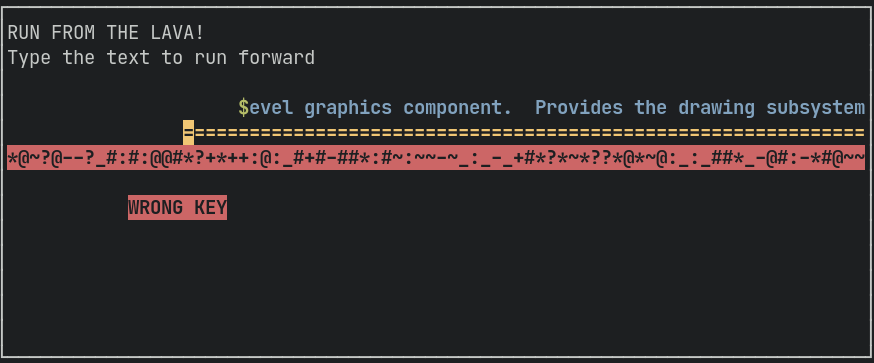

# cursedtypist

Simple typing game inspired by babytype written in python using curses and
asyncio.

## How to run

Just pass your custom text as a command line argument

```console
$ python3 -m cursedtypist $PATH_TO_YOUR_TEXT
```

Type the text as fast as possible to escape from lava and try to avoid mistakes.


